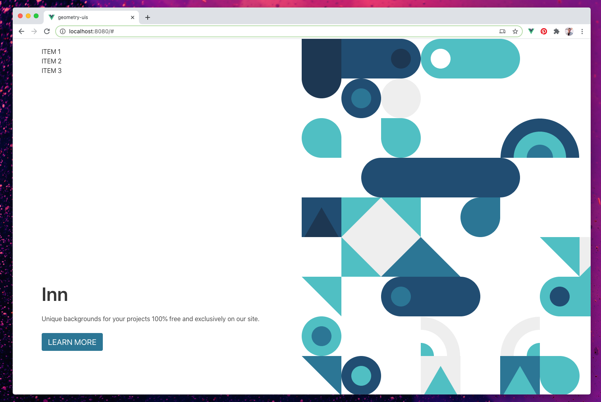

# geometry-uis

Create beautful 2d canvas patterns using a grid of simple geometric shapes.



Using a theme file:

```js
// theme2.js

// define our theme
class ColourTheme {
    constructor() {
        this.colors = [
            '#1d3752',
            '#214d72',
            '#2c7695',
            '#50bfc3',
            '#eeeeee',
            '#ffffff',
        ];
    }
}

export default (Vue) => {
    Vue.prototype.$theme = new ColourTheme();
};
```

And a layout file:

```js
// layout1.js

export default {

    squareSize: 100,

    matrix: [

        // row: 0
        [
            { type: 'Fill', color: 0 },
            { type: 'Fill', color: 1 },
            { type: 'ThumbRight', color: 1, innerColor: 0 },
            { type: 'ThumbLeft', color: 3, innerColor: 5 },
            { type: 'Fill', color: 3 },
            { type: 'SemiLeft', color: 3 },
        ],

        // row: 1
        [
            { type: 'SemiTop', color: 0 },
            { type: 'CircleWithStroke', color: 1, innerColor: 2 },
            { type: 'PlainCircle', color: 4 },
            { type: 'Blank' },
            { type: 'Blank' },
            { type: 'Blank' },
            { type: 'Blank' },
            { type: 'Blank' },
            { type: 'CircleTailed', color:3, tail: 'bottom-right' },
            { type: 'CircleTailed', color:1, tail: 'bottom-left' },
        ],

        // row: 3
        [
            { type: 'CircleTailed', color:3, tail: 'bottom-right' },
            { type: 'Blank' },
            { type: 'CircleTailed', color:3, tail: 'top-left' },
            { type: 'Blank' },
            { type: 'Blank' },
            { type: 'StripesBR', colors: [1,3,2] },
            { type: 'StripesBL', colors: [1,3,2] },
            { type: 'Blank' },
            { type: 'CircleTailed', color:3, tail: 'top-right' },
            { type: 'CircleTailed', color:1, tail: 'top-left' },
        ],

        // empty row: 4
        [
            { type: 'Blank' },
            { type: 'SemiRight', color: 1 },
            { type: 'Fill', color: 1 },
            { type: 'Fill', color: 1 },
            { type: 'Fill', color: 1 },
            { type: 'SemiLeft', color: 1 },
        ],

        // row: 5
        [
            { type: 'SmallTriangle', color:0, bgColor: 1 },
            { type: 'HalfTriangle', color: 3, color2: 4 },
            { type: 'HalfTriangle2', color: 3, color2: 4 },
            { type: 'Blank' },
            { type: 'CircleTailed', color:2, tail: 'top-right' },
        ],

        // row: 6
        [
            { type: 'Blank' },
            { type: 'HalfTriangle2', color: 4, color2: 3 },
            { type: 'HalfTriangle', color: 4, color2: 2 },
            { type: 'HalfTriangle2', color: 5, color2: 2 },
            { type: 'Blank' },
            { type: 'Blank' },
            { type: 'HalfTriangle2', color: 3, color2: 5 },
            { type: 'HalfTriangle', color: 4, color2: 3 },
        ],

        // row: 7
        [
            { type: 'HalfTriangle2', color: 3, color2: 5 },
            { type: 'Blank' },
            { type: 'ThumbLeft', color: 1, innerColor: 2 },
            { type: 'Fill', color: 1 },
            { type: 'SemiLeft', color: 1 },
            { type: 'Blank' },
            { type: 'ThumbLeft', color: 3, innerColor: 1 },
            { type: 'Fill', color: 3 },
            { type: 'SemiLeft', color: 3 },
            { type: 'ThumbLeft', color: 3, innerColor: 1 },
        ],

        // row: 8
        [
            { type: 'CircleWithStroke', color: 3, innerColor: 2 },
            { type: 'Blank' },
            { type: 'Blank' },
            { type: 'StripesBL', colors: [4,5,3] },
            { type: 'Blank' },
            { type: 'StripesBR', colors: [4,5,3] },
        ],

        // row: 9
        [
            { type: 'HalfTriangle2', color: 2, color2: 5 },
            { type: 'CircleWithStroke', color: 1, innerColor: 3 },
            { type: 'Blank' },
            { type: 'SmallTriangle', color: 3, bgColor: 4 },
            { type: 'Blank' },
            { type: 'SmallTriangle', color: 3, bgColor: 2 },
            { type: 'CircleTailed', color: 3, tail: 'top-left' },
        ],

    ],
};
```

## Project setup
```
yarn install
```

### Compiles and hot-reloads for development
```
yarn serve
```

### Compiles and minifies for production
```
yarn build
```

### Lints and fixes files
```
yarn lint
```

### Customize configuration
See [Configuration Reference](https://cli.vuejs.org/config/).
